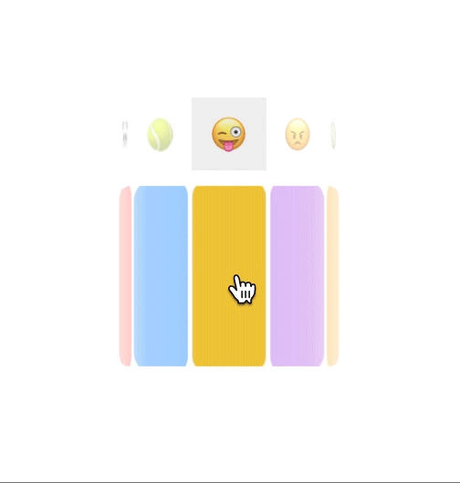
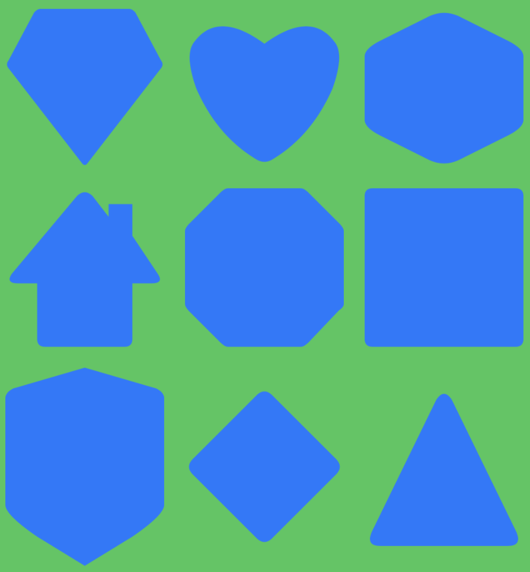

# SwiftUI-Views-and-Tools
Integrate and adjust UIKit, AppKit views into SwiftUI, enhancing SwiftUI development

## Navigate

- [HorizontalPicker](#horizontal_picker)
- [PageView](#page_view)

## HorizontalPicker



### How to use

Drag `HorizontalPicker.swift` into your project

Call
```swift
HorizontalPicker(items: [View], rowHeight: CGFloat, selected: Binding<Int>)
```

parameter `items` could be any SwiftUI View Array

parameter `rowHeight` defines HorizontalPicker's row height

parameter `selected` is a binding integer which indicates the selected view's index

## PageView


## Shapes
Basic shapes draw by swiftUI



